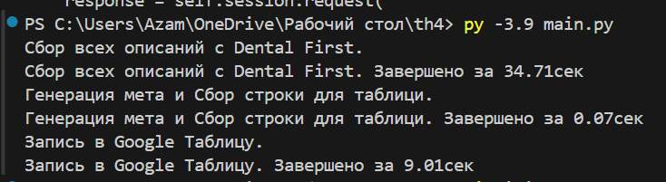

Копировать
Редактировать
# Dental First - Генерация уникальных описаний товаров и метаданных

Этот скрипт автоматизирует процесс сбора описаний товаров с сайта Dental First, генерации уникальных описаний и метаданных, а также записи итоговых данных в Google Таблицу.

---

## Описание работы

1. **Сбор описаний**  
   С помощью модуля `dental_first.get_descriptions` происходит сбор всех описаний товаров конкурента с сайта Dental First.

2. **Генерация уникальных описаний**  
   Для каждого товара генерируется уникальное описание на основе исходного текста и названия товара. Для этого доступны два варианта:
   - Онлайн генерация через API (`gpt_generate_onlain.generate_description_onlain`)
   - Локальная офлайн генерация с использованием загруженной модели (`gpt_generate_offlain.generate_description_offlain`)

3. **Генерация метаданных**  
   Для каждого товара создаются SEO мета-теги (title, description, keywords) через функцию `meta_generator.generate_meta`.

4. **Сбор итоговой строки**  
   Все данные собираются в строки для последующей записи.

5. **Запись в Google Таблицу**  
   Итоговые строки загружаются в Google Sheets с помощью модуля `google_sheet_writer.write_to_sheet`.

---

## Требования

- Python 3.8+
- Установленные зависимости (указать в requirements.txt)
- Доступ к API Google Sheets (сервисный аккаунт или OAuth)
- При использовании онлайн генерации: доступ к API GPT (настроен и доступен)

---

## Установка

1. Клонируйте репозиторий:
   ```bash
   git clone https://github.com/yourusername/dental-first-description-generator.git
   cd dental-first-description-generator
Установите зависимости:

bash
Копировать
Редактировать
pip install -r requirements.txt
Настройте доступ к Google Sheets и API (инструкции для вашего окружения).

Использование
Запустите скрипт командой:

bash
Копировать
Редактировать
python main.py
В процессе скрипт выведет время выполнения ключевых этапов.

Настройки
Для переключения между онлайн и офлайн генерацией описаний раскомментируйте нужную строку в цикле обработки товаров в main.py:

python
Копировать
Редактировать
# unique_desc = generate_description_onlain(...)
unique_desc = generate_description_offlain(...)
Структура проекта
dental_first.py — сбор описаний с сайта Dental First

gpt_generate_onlain.py — генерация описаний через API GPT (онлайн)

gpt_generate_offlain.py — генерация описаний с локальной моделью (офлайн)

meta_generator.py — генерация метаданных

google_sheet_writer.py — запись данных в Google Sheets

main.py — основной скрипт запуска процесса

